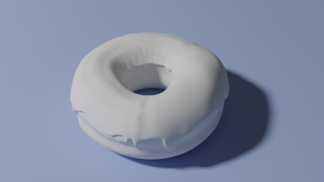
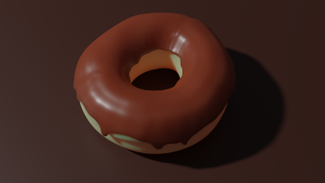

# 3D-Designs
I started designing 3D objects, yey!

# Donut look any further!

Hello World of 3D Objects are Donuts. We all know.\
So here are mine (arosen from Blender Guru's Tutorial):

<table>
  <tr>
    <td> </td>
    <td></td>
  </tr>
  <tr>
    <td></td>
    <td>
  </td>
  </tr>
</table>
